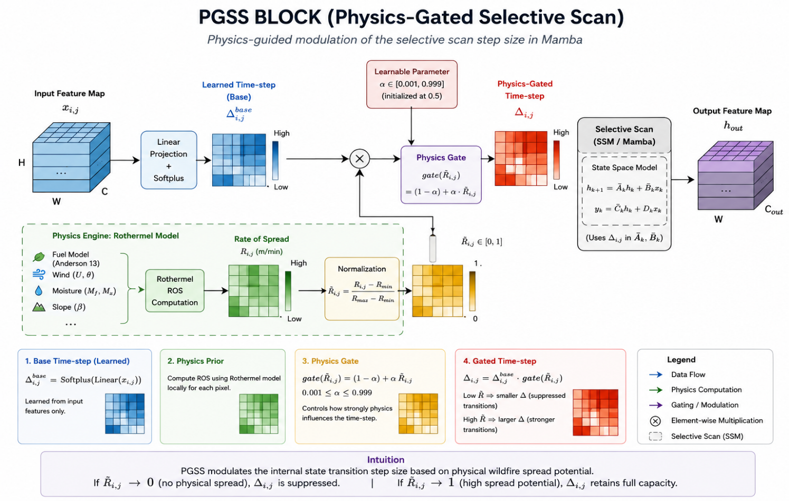
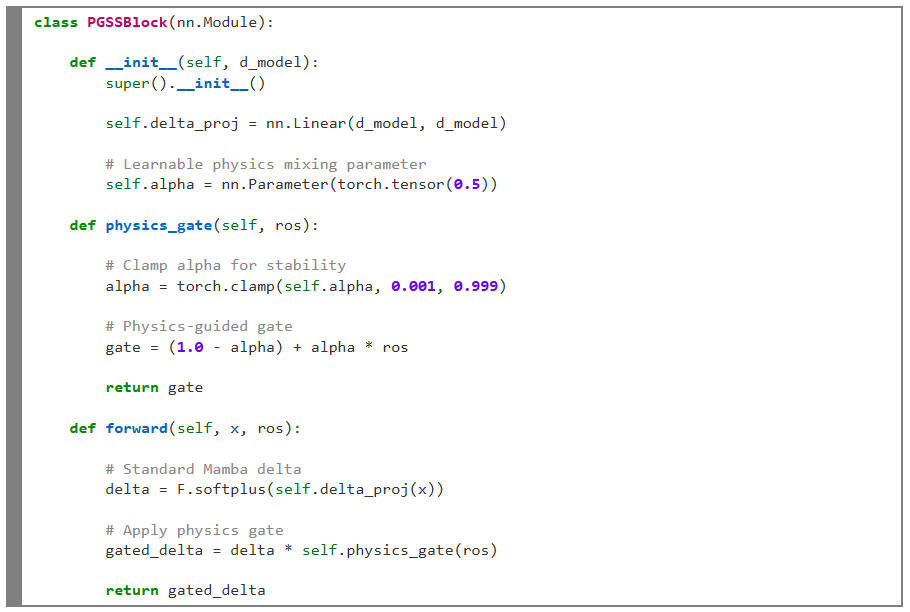
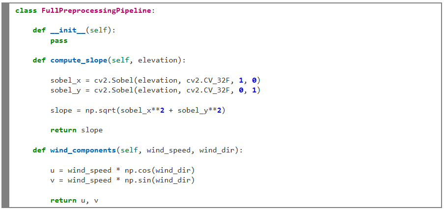
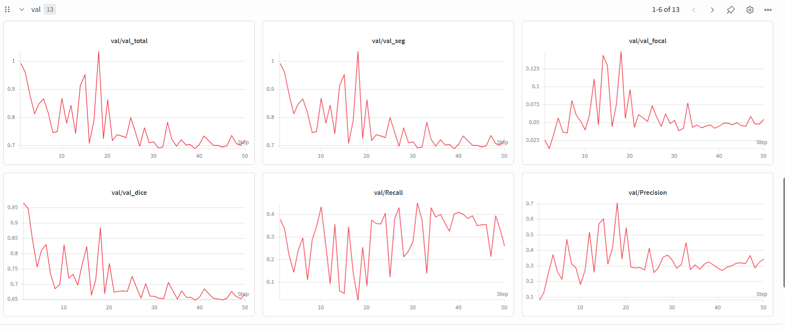

# Physics-Informed Deep Learning for Wildfire Forecasting

**Physics-Informed Vision Mamba (PI-VMUNet) for Short-Term Wildfire Spread Prediction**

> M.Sc. Data Science Capstone Project — Indian Institute of Information Technology, Lucknow  
> **Author:** Toshit Dwivedi (MSD24001) | **Supervisor:** Dr. Niharika Anand

---

## Overview

Wildfires are increasing in frequency and intensity due to climate change, creating a growing need for accurate, real-time spread prediction systems. This project proposes **PI-VMUNet** — a Physics-Informed Vision Mamba architecture that fuses the efficiency of deep learning with the interpretability of Rothermel's fire spread physics.

The core contribution is the **Physics-Gated Selective Scan (PGSS)** block, which injects wildfire spread physics directly into the internal state-space transition dynamics of a Vision Mamba (VM-UNet) backbone — making the model spatially aware of fire risk without relying solely on statistical correlations.

---

## Architecture: Physics-Gated Selective Scan (PGSS)



### Key Idea

Standard Mamba SSMs learn the time-step parameter Δ purely from data:

```
Standard Mamba:  Δ = Softplus(Linear(x))
```

PGSS modulates Δ with a physics-derived Rate of Spread gate:

```
PI-VMUNet (PGSS): Δ = Softplus(Linear(x)) · gate(R̃)
                  gate(R̃) = (1 − α) + α · R̃
```

where:
- **R̃** ∈ [0, 1] — normalized wildfire Rate of Spread from a Rothermel-inspired model  
- **α** — learnable scalar (initialized at 0.5), clamped to [0.001, 0.999]  

**Physical interpretation:**
- R̃ → 0 (low fire spread risk): gate attenuates Δ → state transitions suppressed
- R̃ → 1 (high fire spread risk): gate = 1.0 → full state propagation retained
- α is **learned**, so the model decides how strongly to trust the physics signal



---

## Project Structure

```
ForestFire/
├── pgss_block.py               # PGSS block + RothermelLayer + PIVMUNet
├── rothermel.py                # Rothermel-inspired Rate of Spread computation
├── trainer.py                  # Full training framework (all models)
├── wildfire_dataset.py         # NDWS HDF5 dataset + preprocessing pipeline
├── transforms.py               # FullPreprocessingPipeline (24-channel features)
├── notebook_1_resnet_unet.py   # Baseline: ResNet-UNet
├── notebook_2_swin_unet.py     # Baseline: Swin-UNet
├── notebook_3_vm_unet.py       # Baseline: VM-UNet
├── notebook_4_comparison.py    # Cross-model comparison
├── notebook_5_pi_vmunet_phase3b.py  # PI-VMUNet (Phase 3-B — main experiment)
├── validate_rothermel.py       # Rothermel physics validation tests
├── test_pgss.py                # PGSS unit tests
├── test_transforms.py          # Preprocessing pipeline tests
├── notebooks/                  # Jupyter notebook versions
├── assets/images/              # Architecture diagrams, training curves
└── requirements.txt
```

---

## Dataset

**Next Day Wildfire Spread (NDWS)** — Huot et al., IEEE TGRS 2022

| Split      | Samples |
|------------|---------|
| Train      | 14,979  |
| Validation |  1,877  |
| Test       |  1,689  |

- **Input:** 12 raw environmental channels → 24-channel engineered feature tensor (128×128)
- **Target:** Binary fire mask at T+24h
- **Split strategy:** Event-based (to prevent spatial data leakage between wildfire events)

### Preprocessing Pipeline (24-channel features)

The `FullPreprocessingPipeline` in [transforms.py](transforms.py) engineers physics-relevant features on top of raw satellite channels:

- Slope & aspect estimation (fixed Sobel operators)
- Wind vector decomposition (u, v components)
- Fuel-related parameter mapping
- Approximate heat-of-ignition features



---

## Models

| Model | Architecture | Notes |
|-------|-------------|-------|
| `notebook_1_resnet_unet.py` | ResNet-UNet | CNN baseline |
| `notebook_2_swin_unet.py` | Swin-UNet | Transformer baseline |
| `notebook_3_vm_unet.py` | VM-UNet | SSM baseline |
| `notebook_5_pi_vmunet_phase3b.py` | **PI-VMUNet** | Physics-informed SSM (ours) |

---

## Results

### Quantitative Comparison on NDWS Test Set

| Model | CSI ↑ | Precision ↑ | Recall ↑ | F1 ↑ |
|-------|-------|-------------|----------|------|
| VM-UNet (baseline) | 0.2459 | 0.3361 | **0.4781** | **0.3947** |
| **PI-VMUNet (ours)** | 0.2246 | **0.4025** | 0.3368 | 0.3668 |

> **CSI** (Critical Success Index) is the primary metric for wildfire forecasting tasks.

### Interpretation

The PGSS mechanism shifts prediction behavior from aggressive (high recall) to **physically constrained (higher precision)**:
- PI-VMUNet achieves **+19.8% higher precision** vs. VM-UNet baseline
- This reflects the physics gate suppressing wildfire expansion in low-spread-risk regions
- The learned gating parameter **α converged near 0.5**, indicating the model balances statistical learning and physics guidance simultaneously

### Training Curves (WandB)



> Tracked with Weights & Biases. Run logs: [toshitdwivedi-indian-institute-of-information-technology/pi-vm](https://wandb.ai/toshitdwivedi-indian-institute-of-information-technology/pi-vm)

---

## Loss Function

```
L_total = L_Seg + λ_PDE · L_PDE + λ_Eik · L_Eik + λ_Reg
```

- **L_Seg** = Dice Loss + Focal Loss (γ=2, α=0.25) — handles severe class imbalance (~1–2% fire pixels)
- **L_PDE** = PDE-inspired level-set regularization for wildfire front dynamics *(under experimentation)*
- **L_Eik** = Eikonal regularization for geometric boundary smoothness *(under experimentation)*

Training uses a **3-phase curriculum scheduler** for λ_PDE ramp-up.

---

## Training Setup

- **Hardware:** NVIDIA Tesla T4 GPU (Kaggle)
- **Framework:** PyTorch with mixed-precision training (AMP)
- **Optimizer:** AdamW with Cosine Annealing LR scheduler
- **Logging:** Weights & Biases
- **Checkpointing:** Every 5 epochs + best CSI model; auto-resume on disconnect

---

## Installation

```bash
git clone https://github.com/ToshitDwivedi/Physics-Informed-Deep-Learning-for-Wildfire-Forecasting.git
cd Physics-Informed-Deep-Learning-for-Wildfire-Forecasting
pip install -r requirements.txt
```

> **Note:** `mamba-ssm` and `causal-conv1d` require a CUDA-capable GPU. If unavailable, the PGSS block automatically falls back to a pure PyTorch SSM implementation.

### Dataset

Download the NDWS HDF5 dataset from [Huot et al. (2022)](https://github.com/google-research/google-research/tree/master/simulation_research/next_day_wildfire_spread) and set the path in `wildfire_dataset.py`.

---

## Running Experiments

```bash
# Train PI-VMUNet (Phase 3-B — main model)
python notebook_5_pi_vmunet_phase3b.py

# Train VM-UNet baseline
python notebook_3_vm_unet.py

# Run cross-model comparison
python notebook_4_comparison.py

# Validate Rothermel physics module
python validate_rothermel.py

# Run unit tests
python test_pgss.py
python test_transforms.py
```

---

## Physics Background

The PGSS gate is inspired by **Rothermel's (1972)** empirical fire spread model, which estimates Rate of Spread (RoS) as a function of:
- Wind speed and direction
- Fuel moisture content
- Terrain slope
- Fuel model parameters

Rather than running the full simulator, `RothermelLayer` in [rothermel.py](rothermel.py) computes a differentiable approximation of RoS from the 24-channel input tensor, which is used to gate the selective scan at every encoder/decoder block.

---

## Current Limitations & Future Work

- PDE-based regularization (L_PDE, L_Eikonal) is not yet fully stabilized for large-scale training
- Physics-guided operations add computational overhead vs. pure-data VM-UNet; runtime is a bottleneck on T4
- Hyperparameter search is restricted by GPU memory constraints
- Future: uncertainty-aware prediction, stronger PDE regularization, full CUDA kernel optimization

---

## References

1. Rothermel, R.C. (1972). *A mathematical model for predicting fire spread in wildland fuels.* USDA Forest Service INT-115.
2. Huot, F. et al. (2022). *Next Day Wildfire Spread: A machine learning dataset.* IEEE TGRS, 60, 1–13.
3. Raissi, M. et al. (2019). *Physics-informed neural networks.* Journal of Computational Physics, 378, 686–707.
4. Gu, A. & Dao, T. (2023). *Mamba: Linear-time sequence modeling with selective state spaces.* arXiv:2312.00752.
5. Liu, Y. et al. (2024). *VMamba: Visual State Space Model.* NeurIPS 2024.
6. Ruan, J. & Xiang, S. (2024). *VM-UNet: Vision Mamba UNet for medical image segmentation.* arXiv:2402.02491.
7. Gerard, G. et al. (2023). *Physics-informed deep learning for wildfire spread prediction.* Fire, 6(6), 213.

---

## Citation

```bibtex
@mastersthesis{dwivedi2026piwildfire,
  author    = {Toshit Dwivedi},
  title     = {Physics-Informed State Space Network for Short-Term Wildfire Spread Prediction},
  school    = {Indian Institute of Information Technology, Lucknow},
  year      = {2026},
  type      = {M.Sc. Data Science Capstone Project}
}
```

---

*Indian Institute of Information Technology, Lucknow — M.Sc. Data Science 2024–2026*
