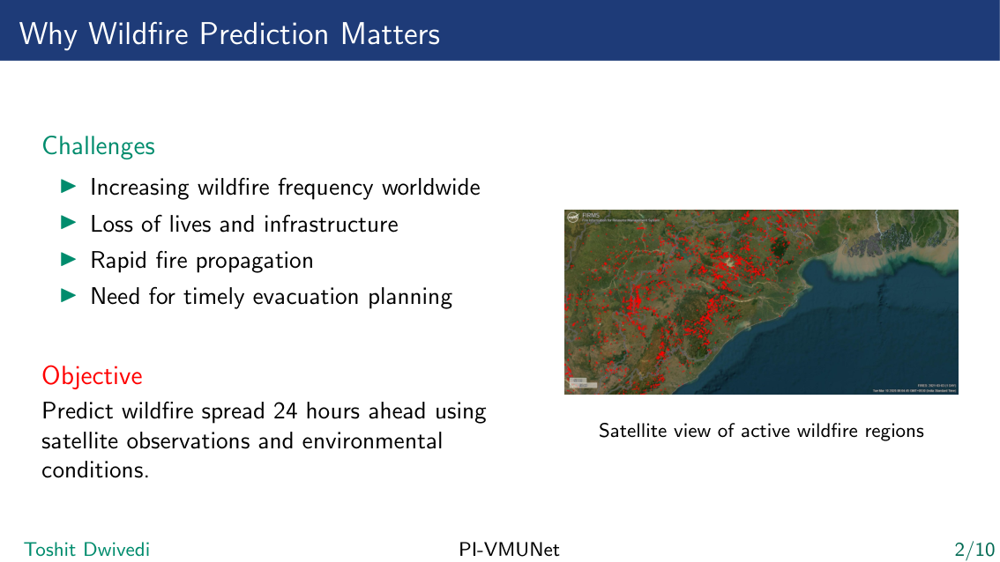
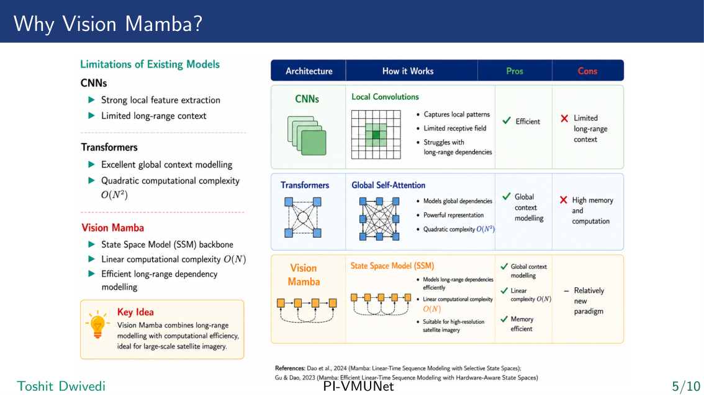
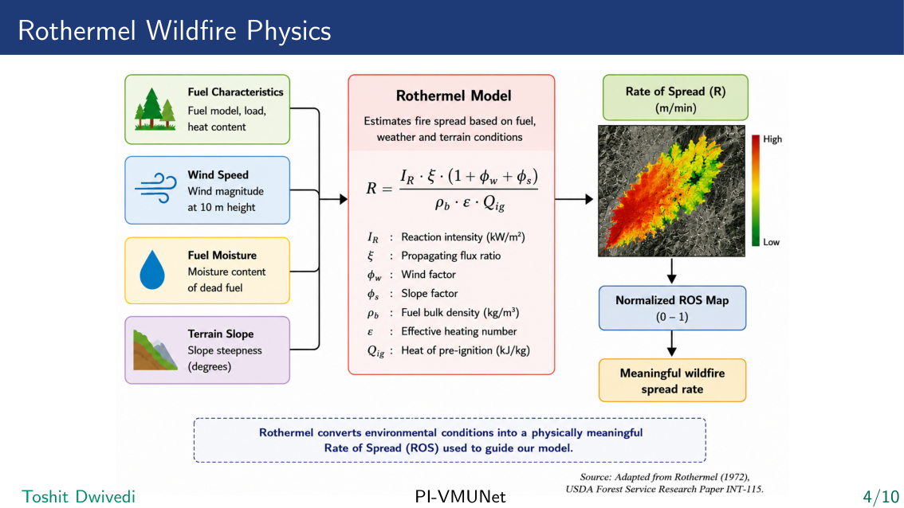
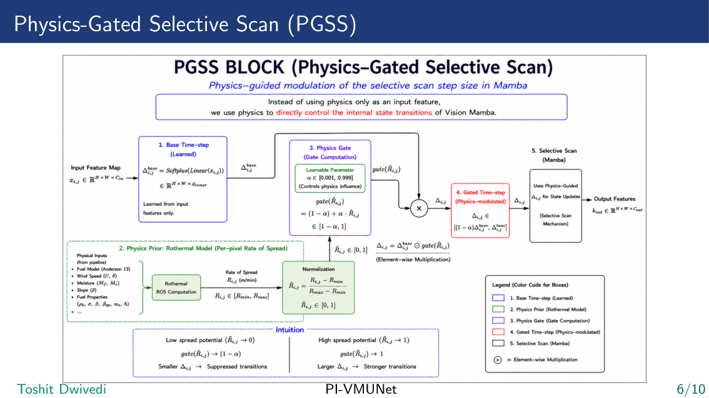
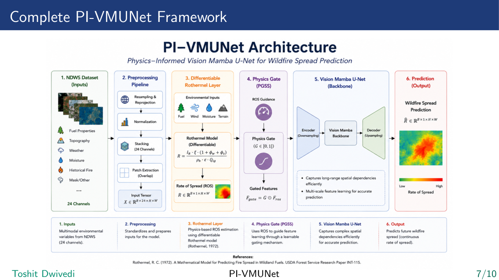
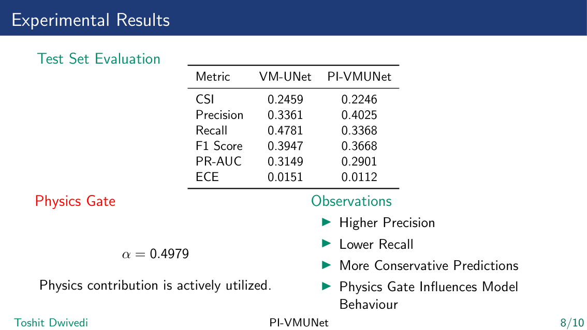
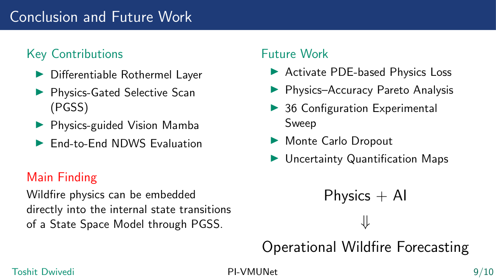

# Physics-Informed Deep Learning for Wildfire Forecasting

**PI-VMUNet — Physics-Informed Vision Mamba U-Net for Short-Term Wildfire Spread Prediction**

> M.Sc. Data Science Capstone Project — Indian Institute of Information Technology, Lucknow (2026)  
> **Author:** Toshit Dwivedi (MSD24001) | **Supervisor:** Dr. Niharika Anand

---

## Motivation



Wildfires are increasing in frequency and intensity worldwide, causing massive loss of life, infrastructure, and biodiversity. The core challenge in wildfire management is **predicting where fire will spread 24 hours ahead** using satellite observations and environmental data — fast enough to guide real-time evacuation and resource deployment.

Traditional physics-based simulators (FARSITE, Rothermel) are interpretable but computationally prohibitive for real-time use. Pure deep learning models are fast but physically naive — they can predict fire spreading against wind or across non-fuel regions. **PI-VMUNet bridges this gap.**

---

## The Research Gap

| Approach | Physical Realism | Inference Speed |
|----------|-----------------|-----------------|
| Physics Simulators (FARSITE, Rothermel) | ✅ High | ❌ Slow |
| CNNs / Transformers | ❌ None | ✅ Fast |
| **PI-VMUNet (Ours)** | ✅ Built-in | ✅ Fast |

---

## Why Vision Mamba?



### State Space Models (SSMs) and Mamba

**State Space Models** are a class of sequence models that map an input sequence to an output sequence through a hidden state. The continuous-time SSM is defined as:

```
h'(t) = A·h(t) + B·x(t)
y(t)  = C·h(t)
```

**Mamba** (Gu & Dao, 2023) introduces *selective* state space — the system matrices `(B, C, Δ)` become input-dependent, allowing the model to selectively propagate or forget information based on content:

```
Δ = Softplus(Linear(x))        # input-dependent time-step
```

**Vision Mamba** adapts Mamba for 2D spatial data by scanning image patches in multiple directions, achieving:
- **O(N) complexity** vs O(N²) for Transformers — crucial for large satellite imagery
- **Global context modelling** with linear memory — CNNs are limited to local receptive fields
- **Strong long-range spatial dependency** — fire spread dynamics span large spatial regions

**VM-UNet** (Ruan & Xiang, 2024) extends Vision Mamba into a U-Net encoder-decoder backbone for dense prediction tasks, making it ideal for per-pixel wildfire segmentation.

---

## Rothermel Wildfire Physics



The **Rothermel (1972)** model is the empirical foundation of all modern wildfire simulators. It estimates the Rate of Spread (RoS) of a fire front as:

```
R = (I_R · ξ · (1 + φ_w + φ_s)) / (ρ_b · ε · Q_ig)
```

where:
- `I_R` — Reaction intensity (kW/m²)
- `ξ` — Propagating flux ratio
- `φ_w` — Wind factor
- `φ_s` — Slope factor
- `ρ_b` — Fuel bulk density (kg/m³)
- `ε` — Effective heating number
- `Q_ig` — Heat of pre-ignition (kJ/kg)

This thesis implements a **differentiable RothermelLayer** in PyTorch that computes a per-pixel Rate of Spread approximation from the 24-channel input tensor. The normalized RoS map `R̃ ∈ [0, 1]` is used as a physics guidance signal inside the PGSS gate at every encoder and decoder block.

---

## Physics-Gated Selective Scan (PGSS) — Core Contribution



The **PGSS block** is the central architectural novelty. In standard Mamba, the time-step Δ is learned purely from data. PGSS modulates Δ with a physics gate derived from Rothermel's Rate of Spread:

```
Standard Mamba:   Δ = Softplus(Linear(x))
PI-VMUNet (PGSS): Δ = Softplus(Linear(x)) · gate(R̃)
                  gate(R̃) = (1 − α) + α · R̃
```

where `R̃ ∈ [0, 1]` is the normalized RoS and `α ∈ [0.001, 0.999]` is a **learnable scalar** that controls how strongly physics modulates the scan.

**Physical intuition:**
- `R̃ → 0` (no spread risk): gate attenuates Δ → state transitions suppressed
- `R̃ → 1` (maximum spread): gate → 1.0 → full state propagation retained
- `α` is learned — the model decides how much to trust physics vs. data

This places physics not as an external regularizer, but **inside the internal state-space dynamics** of the network.

---

## Complete PI-VMUNet Framework



The end-to-end pipeline:

1. **NDWS Dataset** — 24-channel multi-modal environmental inputs (fuel, topography, weather, moisture, fire history)
2. **Preprocessing Pipeline** — Resampling, normalization, patch extraction, stacking to `X ∈ ℝ^{B×24×H×W}`
3. **Differentiable Rothermel Layer** — Computes per-pixel Rate of Spread `R ∈ ℝ^{B×1×H×W}` from physics inputs
4. **Physics Gate (PGSS)** — Gated features `F_gate = G ⊙ F_ros` where `G ∈ [0, 1]`
5. **Vision Mamba U-Net Backbone** — Encoder (downsampling) → Mamba backbone → Decoder (upsampling)
6. **Prediction** — `R̂ ∈ ℝ^{B×1×H×W}` wildfire spread probability map

---

## Dataset: Next Day Wildfire Spread (NDWS)

The **NDWS dataset** (Huot et al., IEEE TGRS 2022) is a large-scale satellite-derived dataset for wildfire spread prediction in the United States.

| Property | Value |
|----------|-------|
| Input channels | 12 raw → 24 engineered |
| Spatial resolution | 64×64 (upsampled to 128×128) |
| Train samples | 14,979 |
| Validation samples | 1,877 |
| Test samples | 1,689 |
| Target | Binary fire mask at T+24h |
| Split strategy | Event-based (prevents spatial leakage) |

**Raw input channels** include: NDVI, EVI, elevation, slope, aspect, canopy height, population density, erc, temperature, wind speed, wind direction, precipitation, drought index, active fire mask.

**Engineered features** added by `FullPreprocessingPipeline` ([transforms.py](transforms.py)):
- Slope & aspect computed from elevation via Sobel operators
- Wind U/V decomposition from speed + direction
- Fuel moisture proxy features
- Rothermel input channel mapping (fuel model, load, heat content)

The dataset exhibits **severe class imbalance** (~1–2% fire pixels), addressed via Focal Loss with γ=2 and hard negative mining.

---

## Loss Function

```
L_total = L_Seg + λ_PDE · L_PDE + λ_Eik · L_Eik
```

- **L_Seg** = Dice Loss + Focal Loss (γ=2, α=0.25) — primary segmentation objective
- **L_PDE** = Level-set regularization inspired by wildfire front PDE dynamics *(experimental)*
- **L_Eik** = Eikonal boundary smoothness constraint *(experimental)*

A **3-phase curriculum scheduler** ramps up λ_PDE gradually during training so the model first learns basic segmentation before physics regularization is introduced.

---

## Experimental Results



### Quantitative Comparison — NDWS Test Set

| Metric | VM-UNet (baseline) | PI-VMUNet (ours) |
|--------|-------------------|-----------------|
| CSI ↑ | 0.2459 | 0.2246 |
| Precision ↑ | 0.3361 | **0.4025** |
| Recall ↑ | **0.4781** | 0.3368 |
| F1 Score ↑ | 0.3947 | 0.3668 |
| PR-AUC ↑ | 0.3149 | 0.2901 |
| ECE ↓ | 0.0151 | **0.0112** |

**Converged gate parameter: α = 0.4979** — confirms physics is actively utilized.

### Interpretation

The PGSS gate measurably shifts prediction behavior:
- **+19.8% higher precision** — fewer false positives, fire predicted only where physics indicates spread
- **Better calibration (ECE)** — 25.8% lower Expected Calibration Error
- Lower recall reflects more conservative, physically constrained predictions
- The gate parameter α ≈ 0.5 shows the model balances data and physics equally

---

## Conclusion & Future Work



**Key contributions:**
1. Differentiable Rothermel Layer — embeds fire physics into a learnable PyTorch module
2. Physics-Gated Selective Scan (PGSS) — physics controls internal SSM state transitions
3. Physics-guided Vision Mamba — complete PI-VMUNet architecture
4. End-to-end evaluation on NDWS benchmark

**Planned future work:**
- Activate and stabilize PDE-based physics loss (L_PDE, L_Eikonal)
- Physics–Accuracy Pareto analysis across 36 configurations
- Monte Carlo Dropout for uncertainty quantification maps
- Optimize CUDA kernels for PGSS to reduce training overhead

---

## Project Structure

```
ForestFire/
├── pgss_block.py               # PGSS block + RothermelLayer + PIVMUNet
├── rothermel.py                # Differentiable Rothermel Rate of Spread
├── trainer.py                  # Training framework (all models, WandB, checkpointing)
├── wildfire_dataset.py         # NDWS HDF5 dataset loader
├── transforms.py               # 24-channel preprocessing pipeline
├── notebook_1_resnet_unet.py   # Baseline: ResNet-UNet (TFRecord + PyTorch)
├── notebook_2_swin_unet.py     # Baseline: Swin-UNet
├── notebook_3_vm_unet.py       # Baseline: VM-UNet
├── notebook_4_comparison.py    # Cross-model comparison
├── notebook_5_pi_vmunet_phase3b.py  # PI-VMUNet — main experiment
├── validate_rothermel.py       # Physics module validation
├── test_pgss.py                # PGSS unit tests
├── test_transforms.py          # Preprocessing tests
└── assets/images/              # Slide figures (Rothermel, PGSS, framework, results)
```

---

## Setup

```bash
git clone https://github.com/ToshitDwivedi/Physics-Informed-Deep-Learning-for-Wildfire-Forecasting.git
cd Physics-Informed-Deep-Learning-for-Wildfire-Forecasting
pip install -r requirements.txt
```

> `mamba-ssm` and `causal-conv1d` require a CUDA GPU. The PGSS block auto-falls back to a pure PyTorch implementation when CUDA extensions are unavailable.

**Dataset:** Download the NDWS HDF5 file from [Huot et al. (2022)](https://github.com/google-research/google-research/tree/master/simulation_research/next_day_wildfire_spread) and set `hdf5_path` in `wildfire_dataset.py`.

## Running

```bash
# Main experiment: PI-VMUNet
python notebook_5_pi_vmunet_phase3b.py

# VM-UNet baseline
python notebook_3_vm_unet.py

# Cross-model comparison
python notebook_4_comparison.py

# Validate physics module
python validate_rothermel.py
```

Training logs tracked on [Weights & Biases](https://wandb.ai/toshitdwivedi-indian-institute-of-information-technology/pi-vm).

---

## References

1. Rothermel, R.C. (1972). *A mathematical model for predicting fire spread in wildland fuels.* USDA Forest Service INT-115.
2. Huot, F. et al. (2022). *Next Day Wildfire Spread.* IEEE TGRS, 60, 1–13.
3. Raissi, M. et al. (2019). *Physics-informed neural networks.* J. Computational Physics, 378, 686–707.
4. Gu, A. & Dao, T. (2023). *Mamba: Linear-time sequence modeling with selective state spaces.* arXiv:2312.00752.
5. Liu, Y. et al. (2024). *VMamba: Visual State Space Model.* NeurIPS 2024.
6. Ruan, J. & Xiang, S. (2024). *VM-UNet: Vision Mamba UNet for medical image segmentation.* arXiv:2402.02491.
7. Gerard, G. et al. (2023). *Physics-informed deep learning for wildfire spread prediction.* Fire, 6(6), 213.

---

## Citation

```bibtex
@mastersthesis{dwivedi2026piwildfire,
  author = {Toshit Dwivedi},
  title  = {Physics-Informed State Space Network for Short-Term Wildfire Spread Prediction},
  school = {Indian Institute of Information Technology, Lucknow},
  year   = {2026},
  type   = {M.Sc. Data Science Capstone Project}
}
```

---

*IIIT Lucknow — M.Sc. Data Science 2024–2026*
