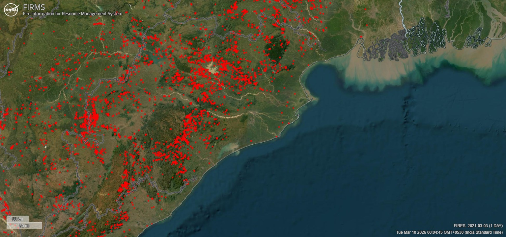
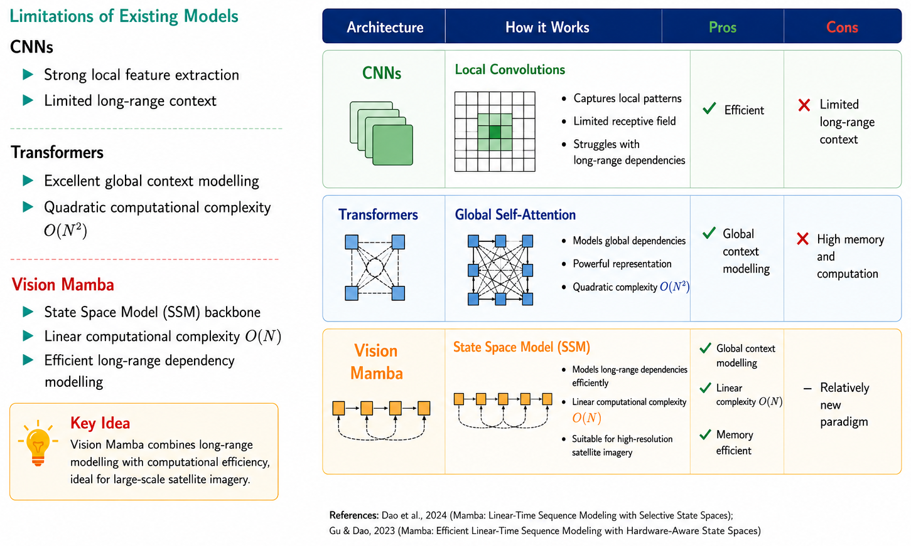
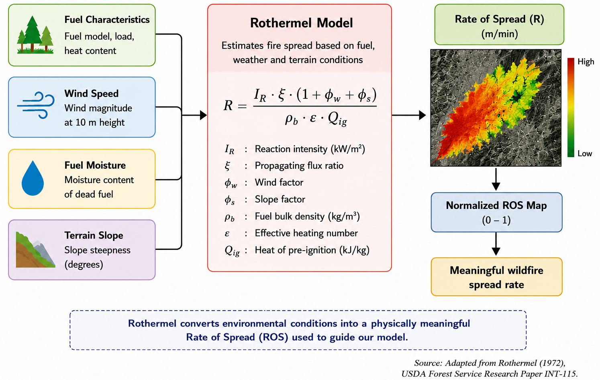
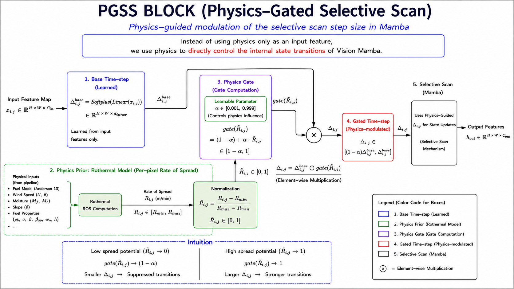
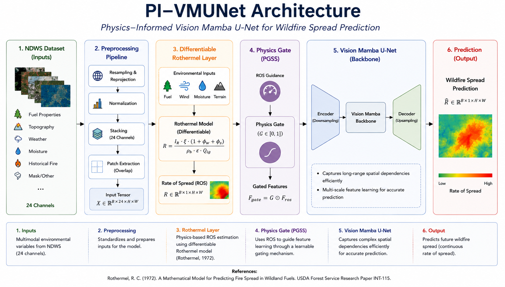

# Physics-Informed Deep Learning for Wildfire Forecasting

**PI-VMUNet — Physics-Informed Vision Mamba U-Net for Short-Term Wildfire Spread Prediction**

> M.Sc. Data Science Capstone Project — Indian Institute of Information Technology, Lucknow (2026)  
> **Author:** Toshit Dwivedi (MSD24001) | **Supervisor:** Dr. Niharika Anand

---

## Motivation



Wildfires are increasing in frequency and intensity worldwide, causing massive loss of life, infrastructure, and biodiversity. The challenge is **predicting where fire will spread 24 hours ahead** using satellite observations and environmental data — fast enough to guide real-time evacuation and resource deployment.

Traditional physics-based simulators (FARSITE, Rothermel) are interpretable but computationally prohibitive. Pure deep learning models are fast but physically naive — they can predict fire spreading against wind or across non-fuel regions. **PI-VMUNet bridges this gap.**

| Approach | Physical Realism | Inference Speed |
|----------|-----------------|-----------------|
| Physics Simulators (FARSITE, Rothermel) | ✅ High | ❌ Slow |
| CNNs / Transformers | ❌ None | ✅ Fast |
| **PI-VMUNet (Ours)** | ✅ Built-in | ✅ Fast |

---

## Why Vision Mamba?



**State Space Models (SSMs)** are a class of sequence models that map inputs to outputs through a hidden state. The continuous-time SSM is:

```
h'(t) = A·h(t) + B·x(t)
y(t)  = C·h(t)
```

**Mamba** (Gu & Dao, 2023) makes the parameters `(B, C, Δ)` input-dependent — selectively propagating or forgetting information based on content. **Vision Mamba** extends this to 2D spatial data by scanning image patches in multiple directions, achieving:

- **O(N) complexity** vs O(N²) for Transformers — critical for large satellite imagery
- **Global spatial context** — CNNs are limited to local receptive fields
- **Long-range dependencies** — fire spread dynamics span large spatial regions

**VM-UNet** (Ruan & Xiang, 2024) wraps Vision Mamba into a U-Net encoder-decoder for dense per-pixel prediction, making it ideal for wildfire segmentation.

---

## Rothermel Wildfire Physics



The **Rothermel (1972)** model is the empirical foundation of all modern wildfire simulators. It estimates Rate of Spread (RoS) as:

```
R = (I_R · ξ · (1 + φ_w + φ_s)) / (ρ_b · ε · Q_ig)
```

| Symbol | Meaning |
|--------|---------|
| `I_R` | Reaction intensity (kW/m²) |
| `ξ` | Propagating flux ratio |
| `φ_w` | Wind factor |
| `φ_s` | Slope factor |
| `ρ_b` | Fuel bulk density (kg/m³) |
| `Q_ig` | Heat of pre-ignition (kJ/kg) |

This thesis implements a **differentiable `RothermelLayer`** in PyTorch ([rothermel.py](rothermel.py)) that computes a per-pixel RoS map from the 24-channel input tensor. The normalized map `R̃ ∈ [0, 1]` drives the PGSS gate at every encoder and decoder block.

---

## Physics-Gated Selective Scan (PGSS) — Core Contribution



In standard Mamba, the time-step Δ is learned purely from data. PGSS gates Δ with Rothermel's Rate of Spread:

```
Standard Mamba:   Δ = Softplus(Linear(x))
PI-VMUNet (PGSS): Δ = Softplus(Linear(x)) · gate(R̃)
                  gate(R̃) = (1 − α) + α · R̃
```

- **`R̃ ∈ [0, 1]`** — normalized per-pixel Rate of Spread
- **`α ∈ [0.001, 0.999]`** — learnable scalar; controls how strongly physics modulates the scan

**Physical intuition:**
- `R̃ → 0` (low spread risk) → gate attenuates Δ → state transitions suppressed
- `R̃ → 1` (high spread risk) → gate = 1.0 → full state propagation retained
- `α` is **learned** — the model decides how much to trust physics vs. data

Physics is embedded inside the SSM's state transition dynamics — not just as an input feature or post-hoc regularizer.

---

## Complete PI-VMUNet Framework



The end-to-end pipeline:

1. **NDWS Dataset** — 24-channel multi-modal environmental inputs
2. **Preprocessing Pipeline** — Resampling, normalization, patch extraction → `X ∈ ℝ^{B×24×H×W}`
3. **Differentiable Rothermel Layer** — Per-pixel Rate of Spread `R ∈ ℝ^{B×1×H×W}`
4. **Physics Gate (PGSS)** — `F_gate = G ⊙ F_ros` where `G ∈ [0, 1]`
5. **Vision Mamba U-Net** — Encoder → Mamba blocks → Decoder
6. **Output** — `R̂ ∈ ℝ^{B×1×H×W}` wildfire spread probability map

---

## Dataset: Next Day Wildfire Spread (NDWS)

The **NDWS dataset** (Huot et al., IEEE TGRS 2022) provides large-scale satellite-derived wildfire spread data across the United States.

| Property | Value |
|----------|-------|
| Input channels | 12 raw → 24 engineered |
| Spatial resolution | 128×128 |
| Train / Val / Test | 14,979 / 1,877 / 1,689 |
| Target | Binary fire mask at T+24h |
| Split strategy | Event-based (prevents spatial data leakage) |

**Engineered features** added by `FullPreprocessingPipeline` ([transforms.py](transforms.py)):
- Slope & aspect via Sobel operators on elevation
- Wind U/V decomposition
- Fuel moisture proxies
- Rothermel input channel mapping (fuel model, load, heat content)

Class imbalance (~1–2% fire pixels) is handled by Focal Loss with γ=2.

---

## Loss Function

```
L_total = L_Seg + λ_PDE · L_PDE + λ_Eik · L_Eik
```

- **`L_Seg`** = Dice Loss + Focal Loss (γ=2, α=0.25)
- **`L_PDE`** = Level-set regularization for wildfire front dynamics *(under experimentation)*
- **`L_Eik`** = Eikonal boundary smoothness constraint *(under experimentation)*

A 3-phase curriculum scheduler gradually ramps up `λ_PDE` so the model first learns basic segmentation before physics regularization is applied.

---

## Results

### NDWS Test Set

| Metric | VM-UNet (baseline) | PI-VMUNet (ours) |
|--------|-------------------|-----------------|
| CSI ↑ | 0.2459 | 0.2246 |
| Precision ↑ | 0.3361 | **0.4025** |
| Recall ↑ | **0.4781** | 0.3368 |
| F1 Score ↑ | 0.3947 | 0.3668 |
| PR-AUC ↑ | 0.3149 | 0.2901 |
| ECE ↓ | 0.0151 | **0.0112** |

**Converged gate parameter: α = 0.4979** — confirms the physics gate is actively utilized.

The PGSS gate shifts prediction behavior from aggressive (high recall) to **physically constrained (higher precision)**:
- **+19.8% higher precision** — fire predicted only where physics supports spread
- **−25.8% lower ECE** — better-calibrated probability estimates
- The near-0.5 α value shows the model balances data-driven and physics-guided learning equally

Training logs tracked on [Weights & Biases](https://wandb.ai/toshitdwivedi-indian-institute-of-information-technology/pi-vm).

---

## Project Structure

```
ForestFire/
├── pgss_block.py               # PGSS block + RothermelLayer + PIVMUNet
├── rothermel.py                # Differentiable Rothermel Rate of Spread
├── trainer.py                  # Training framework (all models, WandB, checkpointing)
├── wildfire_dataset.py         # NDWS HDF5 dataset loader
├── transforms.py               # 24-channel preprocessing pipeline
├── notebook_1_resnet_unet.py   # Baseline: ResNet-UNet (TFRecord loader)
├── notebook_2_swin_unet.py     # Baseline: Swin-UNet
├── notebook_3_vm_unet.py       # Baseline: VM-UNet
├── notebook_4_comparison.py    # Cross-model comparison
├── notebook_5_pi_vmunet_phase3b.py  # PI-VMUNet — main experiment
├── validate_rothermel.py       # Physics module validation
├── test_pgss.py                # PGSS unit tests
├── test_transforms.py          # Preprocessing pipeline tests
└── assets/images/              # Architecture and physics diagrams
```

---

## Setup

```bash
git clone https://github.com/ToshitDwivedi/Physics-Informed-Deep-Learning-for-Wildfire-Forecasting.git
cd Physics-Informed-Deep-Learning-for-Wildfire-Forecasting
pip install -r requirements.txt
```

> `mamba-ssm` and `causal-conv1d` require a CUDA GPU. The PGSS block auto-falls back to a pure PyTorch implementation when CUDA extensions are unavailable.

**Dataset:** Download the NDWS HDF5 file from [Huot et al. (2022)](https://github.com/google-research/google-research/tree/master/simulation_research/next_day_wildfire_spread) and set `hdf5_path` in `wildfire_dataset.py`.

```bash
# Train PI-VMUNet (main experiment)
python notebook_5_pi_vmunet_phase3b.py

# VM-UNet baseline
python notebook_3_vm_unet.py

# Validate Rothermel physics module
python validate_rothermel.py

# Run unit tests
python test_pgss.py && python test_transforms.py
```

---

## Future Work

- Activate and stabilize PDE-based physics loss (L_PDE, L_Eikonal)
- Physics–accuracy Pareto analysis across 36 hyperparameter configurations
- Monte Carlo Dropout for uncertainty quantification maps
- CUDA kernel optimization for PGSS to reduce training overhead

---

## References

1. Rothermel, R.C. (1972). *A mathematical model for predicting fire spread in wildland fuels.* USDA Forest Service INT-115.
2. Huot, F. et al. (2022). *Next Day Wildfire Spread.* IEEE TGRS, 60, 1–13.
3. Raissi, M. et al. (2019). *Physics-informed neural networks.* J. Computational Physics, 378, 686–707.
4. Gu, A. & Dao, T. (2023). *Mamba: Linear-time sequence modeling with selective state spaces.* arXiv:2312.00752.
5. Liu, Y. et al. (2024). *VMamba: Visual State Space Model.* NeurIPS 2024.
6. Ruan, J. & Xiang, S. (2024). *VM-UNet: Vision Mamba UNet for medical image segmentation.* arXiv:2402.02491.
7. Gerard, G. et al. (2023). *Physics-informed deep learning for wildfire spread prediction.* Fire, 6(6), 213.

---

## Citation

```bibtex
@mastersthesis{dwivedi2026piwildfire,
  author = {Toshit Dwivedi},
  title  = {Physics-Informed State Space Network for Short-Term Wildfire Spread Prediction},
  school = {Indian Institute of Information Technology, Lucknow},
  year   = {2026},
  type   = {M.Sc. Data Science Capstone Project}
}
```

---

*IIIT Lucknow — M.Sc. Data Science 2024–2026*
